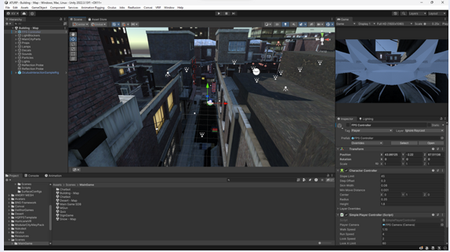
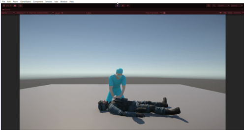

# C-projects

# Welcome to My GitHub Profile!

## Featured Projects

### 1. [TVS VR Training Simulator](https://github.com/HariniV2907/TVS)

This project is focused on developing a Virtual Reality (VR) training simulator for the assembly of a vehicle’s components. It aims to revolutionize employee training by providing an immersive environment where employees can interact with 3D representations of the assembly process. This enhances their understanding and skills in a safe, controlled environment.

**Key Features:**
- Immersive VR environment for realistic training.
- Interactive 3D assembly process.
- Safe and controlled training experience.

**Images:**
- 
- 
- 

**Plugins Used:**
- **External Plugins:** Unity for 3D rendering and VR integration.
- **Internal Plugins:** Custom scripts and assets to enhance interactivity and realism.

---

### 2. [SIH1410 - XR Training Project](https://github.com/QuartVR/SIH1410)

The XR Training Project is a cutting-edge solution designed for live military training, showcased at SIH 2023 under the problem statement SIH1410. This project combines advanced rendering techniques, machine learning, and seamless hardware integration to provide a realistic and interactive training experience.

**Key Features:**
- Accurate 3D replication of original environments.
- Player interaction and communication.
- Obstacle detection using collider technology.
- Direction management and diverse case scenarios.

**Images:**
- 
- 
- 
- 
- 
- 
- 
- 
- 
- 
- 
- 
- 
- 

**Built With:**
- **Unity:** For creating 3D environments using advanced rendering techniques.
- **Unreal Engine:** To produce high-quality environments.
- **Convai:** A Unity plugin for integrating chatbots that assist users during training.

**Requirements:**
- **Software:**
  - Unity: 3D environment creation, player interaction, obstacle detection.
  - Unreal Engine: High-quality environment production.
  - Convai: Chatbot integration within Unity.

- **Hardware:**
  - Oculus Quest 2: High-resolution display, advanced tracking, vast game library.
  - Oculus Quest 3: Enhanced cameras, sensors, and color passthrough capabilities.

---

